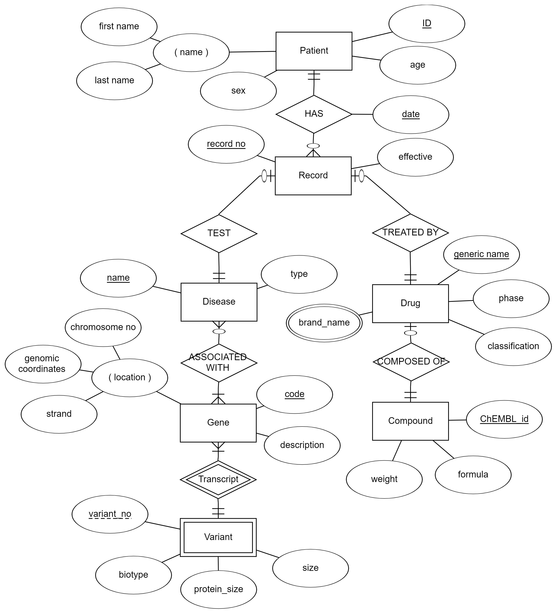

# DRUG DISCOVERY COMPANY: DRUGOPOPS

## Abstract

Drug Discovery is the process of identifying new therapeutics through computational and experimental methods. In general, it consists of 3 phases: development, clinical and postlaunch. This would require the creation of large data warehouses, and usually bioinformatics algorithms are involved in drug target identification. This database management system manages a drug discovery company's collected data of clinical trials and allows a team of experts (including pharmacologists, chemists, drug metabolism specialists, toxicologists, process chemists, and formulation and regulatory experts) to access a specialized part of it in order to relate biological and chemical entities with genetically based diseases, and neurodegenerative disorders in particular. This can be especially useful to come up with inferential statistics around the effectiveness of a drug and its chemical compounds in connection with the genetical origin of the disease.

## Introduction

**Drug Discovery** consists of target identification, assay development, high throughput screening of small molecule libraries for hit identification, lead discovery and optimization, preclinical development, investigational new drug (IND) filing, clinical trials, and filing for final FDA approval (Thomas et al., 2010 as cited in Sun et al., 2017).

A **Database Management System** role is to handle the storage, retrieval and organization of data allowing interaction and manipulation of this data by end users. Companies involved in drug discovery have a huge amount of data to process in the drug design phase, therefore require a database management system that efficiently manage and store data- regarding drugs, diseases and records of clinical trials- for a long period of time safely.

A **Genetic Disease** originates from a flaw in the original genetic information, and can be due to mutation of genes, gross chromosomal abnormalities or temporal/spatial patterns of expression among other cases. In this project, the main interest will be around a mutation caused diseases, where genetical data will be stored and studied by the users of the DBMS.

## ER model

### Entities

The entities in this DBMS are:

- Patient
- Record
- Disease
- Gene
- Drug
- Chemical Compound
- Variant

_Entities are further explained in detail:_

#### Patient

_ **Attributes:** _

- SSN: Social Security Number, unique identifier to each patient
- Name: composed of
  - First name
  - Middle name
  - Last name
- Age
- Sex

#### Record

_ **Attributes:** _

- Record number: each record has an auto-generated number
- Effective: test whether the trial was effective, not effective or unknown

#### Disease

_ **Attributes:** _

- Name: each disease has a unique name that identifies it
- Type

#### Gene

_ **Attributes:** _

- Code: unique identifier
- Location:
  - Chromosome number
  - Genomic coordinates
  - Strand
- Description

#### Drug

_ **Attributes:** _

- Generic name: unique identifier
- Biological classification
- Group: experimental/approved/investigational…

#### Compound

_ **Attributes:** _

- ID: unique identifier from ChEMBL database
- Molecular formula
- Molecular weight
- Molecule type
- Phase: progress in testing clinical trials

#### Variant

_Weak entity: dependent on Gene_

_ **Attributes:** _

- Number: partial key, defines the variant with the gene name
- Biotype: variant's functionality
- Size: size of the ORF per base pairs (bp)
- Protein size: length of its decoded protein per amino acid (aa) (NULL when there is no protein)

### Relationships

The entities have the following characteristics:

- Patient HAS Record:
  - Each patient can have one or more clinical trial (record)
  - Each record must be done on one patient
  - The clinical trial has a date as a relationship attribute
- Record TESTS Disease:
  - Each record must be testing one disease during the trial
  - Each disease can be tested in a record
- Record TREATED BY Drug:
  - Each record must test the efficiency of one drug
  - Each drug can be tested in a record
- Disease ASSOCIATED WITH Gene:
  - Each disease in this database (since we're dealing strictly with genetic diseases) is associated to one or more genes
  - Each gene may contribute in a genetic disease
  - _ **Note: usually more than one gene cause more than one disease but for the sake of simplicity, it's now considered as a many to one relationship** _
- Gene HAS Variant:
  - Each gene can have one or multiple variants
  - Each variant is dependent on one gene
  - This is an identifying relationship since there does not exist a variant without a gene
- Drug COMPOSED OF Compound
  - Each drug is a chemical entity hence must be composed of a chemical compound
  - Each chemical compound can form a drug

### ER Schema

_Made using erdplus.com_

## Relational Database Model

### Mapping Algorithm:

Mapping the ER diagram into a RDM follows a 6-steps algorithm:

#### Strong entities

This step consists of mapping each of the Strong Entities to its attributes. Strong entities are those who can stand on their own, their primary key can uniquely identify them from the rest and they are part of the mini-world (the database). Problems will arise when we're dealing with non-simple attributes since values will no longer be atomic. **Composite attributes** are further divided into smaller atomic attributes forming new simple attributes, and **multivalued attributes** are left out for a later stage of mapping. _Note that the relationship attribute date belonging to the 1: N relationship is weighted to the N side (RECORD), thus will be counted as an attribute in table Record._

PATIENT

| ID | first\_name | last\_name | age | sex |
| --- | --- | --- | --- | --- |

RECORD

| record\_no | date | effective |
| --- | --- | --- |

DISEASE

| name | type | stage |
| --- | --- | --- |

DRUG

| generic\_name | phase | classification |
| --- | --- | --- |

COMPOUND

| ID | molecular\_formula | weight | type |
| --- | --- | --- | --- |

GENE

| code | description | chromosome\_no | coordinates | strand |
| --- | --- | --- | --- | --- |

#### Weak entities

The weak entity in this database is VARIANT, dependent on GENE. Thus, variant has 2 values as primary keys: its partial key and its foreign key to Gene (also because of the 1:N identifying relationship, the foreign key gene is added).

VARIANT

| gene | varianrt\_no | biotype | size | protein\_size |
| --- | --- | --- | --- | --- |

#### 1: 1 relationships

One-to-one relationships impose a foreign key on the total participation side of the relationship. To ensure 1:1, the foreign key attribute will have the constraint UNIQUE. Thus, the following:

RECORD

| record\_no | date | patient\_id | disease\_name | drug\_name | effective |
| --- | --- | --- | --- | --- | --- |

DRUG

| generic\_name | phase | molecule | classification |
| --- | --- | --- | --- |

#### 1: N relationships

One-To-Many relationships impose a foreign key on the "many" side of the relationship. To ensure total participation (if needed), constraint NOT NULL will be added on the foreign key attribute. Thus, the following:

GENE

| code | description | chromosome\_no | coordinates | strand | phenotype |
| --- | --- | --- | --- | --- | --- |

#### M: N relationships

Usually many-to-may relationships require creating a new table, however there are no such relationships in this database.

#### Multivalued attributes

Drug has a multivalued attribute: brand name. Each drug can have 0 or more brand names, thus a new table is formed.

BRAND\_NAME

| drug | name |
| --- | --- |

### Relational Model

Thus, the following Relational Model:

PATIENT

| ID | first\_name | last\_name | age | sex |
| --- | --- | --- | --- | --- |

RECORD

| record\_no | date | patient\_id | disease\_name | drug\_name | effective |
| --- | --- | --- | --- | --- | --- |

  

DISEASE

| name | type |
| --- | --- |

 

DRUG

| generic\_name | phase | molecule | classification |
| --- | --- | --- | --- |

  

COMPOUND

| ID | molecular\_formula | weight | type |
| --- | --- | --- | --- |

GENE

| code | description | chromosome\_no | coordinates | strand | phenotype |
| --- | --- | --- | --- | --- | --- |

 

VARIANT

| gene | varianrt\_no | biotype | size | protein\_size |
| --- | --- | --- | --- | --- |

BRAND\_NAME

| drug | name |
| --- | --- |

### Relational Model Constraints

#### Domain Constraints

Values must satisfy the description, data type and format specified in the domain. In this project, emphasis was on specifying the datatype and length of each value.

#### Key Constraints

This constraint forces uniqueness of each tuple; i.e., no 2 tuples have the same values. That can be achieved by setting the Primary Key to be unique (which can be done in SQL with only the PRIMARY KEY constraint) since primary key is the unique identifier of each tuple.

#### Entity Integrity Constraints

This forced the Primary key not be NULL. Having PK as the unique identifier, it's not allowed to be "unknown", since it will no longer define the tuple. Thus, a NOT NULL constraint is added to each PK attribute.

#### Referential Integrity Constraints

For a table to reference another table, this should be done using Foreign Keys. While referring to other tables, 2 rules should be met:

- FK attribute has the same domain as the PK it's referring to
- It can either refer to a PK that already exists or be NULL

For integrity validation, ON DELETE and ON UPDATE were used to CASCADE; i.e., modify FK values whenever updating the original PK values and setting it to NULL when deleting the latter.

## Implementation

_This project was implemented using MySQL_.

Implementing the database using SQL is composed of several steps.

- First: to construct the tables we must use SQL as a Data Definition Language (DDL).
- Second: Inserting data values, deleting and updating is part of the Data Manipulation Language (DML). Some data were generated using python scripts and converted to SQL syntax using regex. Any reference to any patient or possible trial test is not related to real life tests. Note that some of the scientific data were populated from public databases:
  - ChEMBL: used for DRUG and COMPOUND
  - ENSEMBLE: used for GENE and VARIANT
- Third: Querying the tables and coming up with projections and selections is through Data Query Language (DQL).

## Normalization

### 1NF

The first normal form states that each cell is atomic. This is achieved by breaking down each composite and multivalued attribute into simple attributes in order not to get composite values within the table. For instance, the composite attribute location is separated to 3 attributes in GENE and a new table was created to store the multivalued attribute in brand\_name DRUG.

### 2NF

The second normal form states that every non-key attribute is functionally dependent on the primary key. This property holds for all table since the PK in each table functionally defines each other attribute in the same table.

### 3NF

The third normal form states that there's no transitive functional dependency. Hence, values only depend on the key and nothing but the key. This property is satisfied since no transitivity is present within the tables.

### BCNF

The Boyce-Codd normal form states that every functional dependency rely on the super key. It's obeyed in this project attributes in each table functionally depend only on the primary key which is a super key.

_This page is intentionally left blank_

## References

Sun, W., Zheng, W., & Simeonov, A. (2017). Drug discovery and development for rare genetic disorders. _American journal of medical genetics. Part A_, _173_(9), 2307. [https://doi.org/10.1002/ajmg.a.38326](https://doi.org/10.1002/ajmg.a.38326)

Wooller, S. K., Benstead-Hume, G., Chen, X., Ali, Y., & Pearl, F. M. (2017). Bioinformatics in translational drug discovery. _Bioscience Reports_, _37_(4). [https://doi.org/10.1042/BSR20160180](https://doi.org/10.1042/BSR20160180)

58
